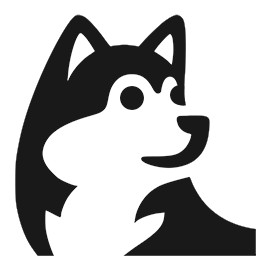

# ブラウザ拡張 Copy Dog



## 概要
表示しているページの、タイトル、URL、公開日時、著者、OGP画像のパスを取得し、クリップボードにコピーする、Firefox アドオンです。(⚠️ Chrome版は後日対応予定)  
実行は、コンテキストメニューもしくはショートカット Alt+C で実行します。  
出力形式は、マークダウンに対応している他、設定画面で自由にカスタマイズできます。

## バージョン履歴
2026/01/03 ver1.0.0


## 開発

### ビルド

プロジェクトのルートディレクトリで以下のコマンドを実行します。
これにより、必要なファイルから xpi ファイルが生成されます。
``` bash
$ node scripts/build.mjs
```


### ローカル開発

ビルド後、以下の方法でローカル開発・テストを行います。

1. Firefoxで `about:debugging` にアクセス
2. 「このFirefox」タブを選択
3. 「一時的なアドオンを読み込む」をクリック
4. 生成された xpi ファイルを選択

コードを変更して再ビルドした場合、`about:debugging` ページで「再読み込み」ボタンをクリックするだけで変更が反映されます。


### 公開前のチェック
アドオンを登録し、自身でインストールしてチェックします。
https://addons.mozilla.org/ja/developers/

問題なければ、公開します。